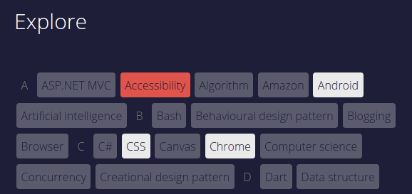

# tag-explorer [](https://www.npmjs.org/package/tag-explorer)

A js library that creates a tag cloud that can filter articles by multiple tags. Each tag that is selected will fade tags that are not contained in any of the currently visible articles to allow the user to narrow down the filter much easier. The principal implementation of the library is in my website, [Growing with the Web][1] ([source code][2]).



## Installing

```bash
npm install --save tag-explorer
```

## Including

```html
<script src="node_modules/tag-explorer/dist/tag-explorer.min.js"></script>
```

## Usage

```javascript
// The container to hold the tags.
tagContainer = document.querySelector('.tag-container'); 

// An array of objects where the `'element'` property is the article element (to
// be hidden), and the `'tags'` attribute is an array of tags on this article.
// Articles do not necessarily have to be the <article> element.
articles = [].slice.call(document.querySelectorAll('article')).map(function (article) {
  return {
   'element': article,
   'tags': [].slice.call(article.querySelectorAll('.tags li')).map(function (tag) {
     return tag.textContent;
   })
  };
});

// Create an array of tag names to be available for filtering.
tagNames = ['CSS', 'HTML', 'JS'];

// Initialise tag-explorer.
tagExplorer(tagContainer, articles, tagNames);
```

## Stucture and styling

The following HTML is generated within `tagContainer`.

```html
<menu>
  <li>
    <div class="letter-header">A</div>
    <button>A title</button>
  </li>
  <li>
    <button>Another title</button>
  </li>
  <li>
    <div class="letter-header">N</div>
    <button>Next title</button>
  </li>
</menu>
```

### `.active` and `.selected`

When at least one button has been toggled, the `.selected` class is added to the button and `.active` is applied to all 'tag neighbours` which are tags that are also present in articles that contain all selected tags. With styling.

### `.show-all`

The `.show-all` class is applied to `tagContainer` when no tags are selected, this allows overriding of `:not(.active)` styles if no `.active` style exists.

### Styles

Styles can be added rooted in `tagContainer`, for example:

```css
.tag-container { ... }
.tag-container menu { ... }
.tag-container li { ... }
.tag-container .letter-header { ... }
.tag-container button { ... }
/* Style for active buttons (unselected tag neighbours or when no tags are selected */
.tag-container.show-all button,
.tag-container .active { ... }
.tag-container :not(.active) { ... }
.tag-container .selected { ... }

/* Hide articles without .active */
article {
  display: none
}
/* Style article visibility, this does not necessarily need to be an article tag */
article.active { ... }
```


[1]: http://www.growingwiththeweb.com/
[2]: https://github.com/Tyriar/tyriar.github.io
